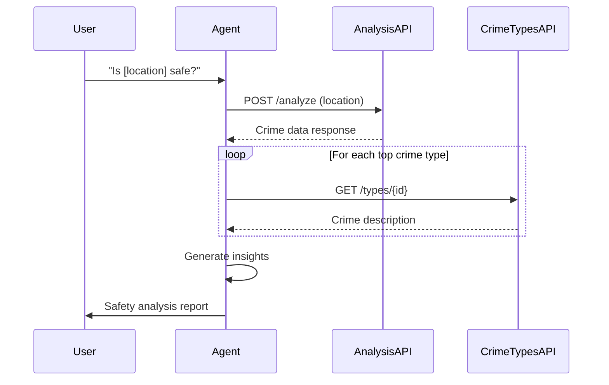

# PRD: Criminal Activity Analysis Skill

> **Version:** 1.0  
> **Date:** 2026-01-31  
> **Status:** Draft

---

## Overview

This document defines the requirements for implementing a **Criminal Activity Analysis** skill that enables the OpenClaw agent to query a criminal activity analysis API and provide intelligent safety insights about locations in São Paulo state.

---

## Problem Statement

Users need a way to assess the safety of specific locations before visiting them. Currently, there is no integrated solution to:

1. Analyze criminal activity data for a given location
2. Interpret complex crime statistics into actionable insights
3. Provide time-of-day safety recommendations

---

## Goals

- Enable the agent to call the criminal activity analysis API with a location query
- Fetch human-readable crime type descriptions from the crime types API
- Generate clear, actionable safety insights based on the data (in English)
- Cover different time periods (morning, afternoon, dawn, night)
- Present crime statistics in an understandable format
- Coverage limited to São Paulo state

---

## API Specification

### 1. Activity Analysis Endpoint

```bash
curl --location 'http://thomas:11004/api/v1/criminal/activity-analysis/analyze' \
  --header 'X-API-KEY: <API_KEY>' \
  --header 'Content-Type: application/json' \
  --data '<location_query>'
```

| Field | Description |
|-------|-------------|
| **URL** | `http://thomas:11004/api/v1/criminal/activity-analysis/analyze` |
| **Method** | `POST` |
| **Headers** | `X-API-KEY`, `Content-Type: application/json` |
| **Body** | Plain text location query (e.g., `praca da republica`) |

#### Response Structure

```json
{
  "id": null,
  "type": null,
  "location": {
    "x": -46.6425205,
    "y": -23.5431712,
    "type": "Point",
    "coordinates": [-46.6425205, -23.5431712]
  },
  "content": {
    "<period>": {
      "scorePosition": 1,
      "score": 452300.0,
      "criminalDangerZonesContainingLocation": [...],
      "occurrencesWithinCriminalDangerZones": [
        { "crimeType": 497, "count": 1858 },
        { "crimeType": 319, "count": 1468 }
      ]
    }
  }
}
```

| Field | Description |
|-------|-------------|
| `location` | Geocoded coordinates of the queried location |
| `content.<period>` | Time period (`morning`, `afternoon`, `dawn`, `night`) |
| `scorePosition` | Danger ranking position in São Paulo state |
| `score` | Numerical danger score |
| `occurrencesWithinCriminalDangerZones` | Array of crime types with occurrence counts |

---

### 2. Crime Type Description Endpoint

```bash
curl --location 'http://thomas:11004/api/v1/criminal/types/<crime_type_id>' \
  --header 'Accept: application/json' \
  --header 'X-API-KEY: <API_KEY>'
```

#### Response Structure

```json
{
  "id": 492,
  "description": "ROUBO (ART. 157) - INTERIOR TRANSPORTE COLETIVO",
  "score": 8.0
}
```

| Field | Description |
|----------|-------------|
| `id` | Crime type identifier |
| `description` | Human-readable crime description (Portuguese) |
| `score` | Severity weight |

---

## Functional Requirements

### FR-1: Location Analysis

The skill must:
- Accept a user-provided location query (address, landmark, or neighborhood)
- Call the activity analysis API with the location query
- Handle API errors gracefully (timeout, invalid response, authentication failure)

### FR-2: Crime Type Resolution

The skill must:
- Extract unique crime type IDs from the analysis response
- Fetch descriptions for the top 10-15 most frequent crime types

### FR-3: Insight Generation

The agent must analyze the response and provide:

1. **Overall Safety Assessment**
   - Use dynamic thresholds based on period maximum scores
   - Provide a qualitative rating (High Risk, Medium Risk, Low Risk)

2. **Most Frequent Crimes**
   - List the top 5-10 crime types by occurrence count
   - Include human-readable descriptions

3. **Time Period Analysis**
   - Present safety levels for each available time period
   - Highlight the safest and most dangerous periods

4. **Actionable Recommendations**
   - Suggest precautions based on prevalent crime types
   - Recommend safer time windows for visiting

---

## Risk Classification Logic

Use dynamic thresholds based on maximum scores per time period:

```javascript
const PERIOD_MAX_SCORES = {
    "dawn": 128000.0,
    "afternoon": 165000.0,
    "morning": 185000.0,
    "night": 300000.0
};

const score = periodData.score || 0;
const scorePosition = periodData.scorePosition || 'unknown';
const maxScore = PERIOD_MAX_SCORES[periodKey];

// Dynamic threshold calculation
const highThreshold = maxScore * 0.70;   // 70% of max
const mediumThreshold = maxScore * 0.30; // 30% of max

if (score > highThreshold) {
    // HIGH RISK: This zone ranks #N most dangerous in São Paulo state
    // during this period. Exercise extreme caution.
} else if (score > mediumThreshold) {
    // MEDIUM RISK: This zone has moderate risk during this period.
    // Position: #N. Exercise caution.
} else {
    // LOW RISK: This zone is relatively safe during this period.
    // Position: #N.
}
```

| Threshold | Risk Level | Description |
|-----------|------------|-------------|
| > 70% of max score | 🔴 High | Most dangerous zones in São Paulo state |
| 30-70% of max score | 🟠 Medium | Moderate risk, exercise caution |
| < 30% of max score | 🟢 Low | Relatively safe zones |

---

## User Experience

### Example User Interaction

**User:** "Is Praça da República safe?"

**Agent Response:**

> **📍 Safety Analysis: Praça da República, São Paulo**
>
> **⚠️ Overall Assessment: High Risk Area**  
> This zone ranks **#1** most dangerous in São Paulo state during morning hours.
>
> **🕐 Time Period Analysis:**
> | Period | Risk Level | Position | Score |
> |--------|------------|----------|-------|
> | Dawn | 🟠 Medium | #5 | 45,000 |
> | Morning | 🔴 High | #1 | 152,300 |
> | Afternoon | 🟠 Medium | #3 | 89,000 |
> | Night | 🔴 High | #2 | 245,000 |
>
> **📊 Most Common Crimes (Morning):**
> 1. **Theft (Art. 155)** - 1,858 occurrences
> 2. **Robbery - Other** - 1,468 occurrences
> 3. **Cell Phone Robbery** - 700 occurrences
> 4. **Public Transport Robbery** - 598 occurrences
> 5. **Pedestrian Theft** - 380 occurrences
>
> **💡 Recommendations:**
> - Keep valuables concealed, especially mobile phones
> - Avoid displaying expensive items
> - Consider visiting during dawn when risk is lower
> - Stay aware of your surroundings, especially in crowded areas

---

## Configuration

### Environment Variables

| Variable | Description | Required |
|----------|-------------|----------|
| `CRIMINAL_ANALYSIS_API_URL` | Base URL for the API (default: `http://thomas:11004`) | Yes |
| `CRIMINAL_ANALYSIS_API_KEY` | Authentication key | Yes |

### Skill Metadata

```yaml
name: criminal-activity-analysis
description: Analyze criminal activity and safety levels for locations in São Paulo state
metadata:
  openclaw:
    emoji: "🚨"
    requires:
      bins: ["curl"]
      env: ["CRIMINAL_ANALYSIS_API_KEY"]
    primaryEnv: "CRIMINAL_ANALYSIS_API_KEY"
```

---

## Technical Implementation

### Proposed Directory Structure

```
skills/criminal-activity-analysis/
├── SKILL.md              # Main skill instructions
└── examples/
    └── sample-response.json
```

### Implementation Flow



---

## Acceptance Criteria

- [ ] Agent can successfully query the activity analysis API
- [ ] Agent can resolve crime type IDs to human-readable descriptions
- [ ] Response includes overall safety assessment using dynamic thresholds
- [ ] Response includes time period breakdown (dawn, morning, afternoon, night)
- [ ] Response lists most frequent crime types with counts
- [ ] Response provides actionable recommendations
- [ ] All insights are provided in English
- [ ] API errors are handled gracefully with user-friendly messages

---

## Constraints

- **Geographic Scope:** This API is limited to São Paulo state only
- **Language:** All agent responses must be in English
- **Infrastructure:** Local API (no rate limiting concerns)

---

## Appendix

### Period Maximum Scores Reference

| Period | Max Score | High Threshold (70%) | Medium Threshold (30%) |
|--------|-----------|---------------------|------------------------|
| Dawn | 128,000 | 89,600 | 38,400 |
| Morning | 185,000 | 129,500 | 55,500 |
| Afternoon | 165,000 | 115,500 | 49,500 |
| Night | 300,000 | 210,000 | 90,000 |

### Sample Crime Types

| ID | Description | Score |
|----|-------------|-------|
| 492 | Robbery (Art. 157) - Public Transport | 8.0 |
| 497 | Theft (Art. 155) | 5.0 |
| 319 | Robbery - Other | 8.0 |
| 494 | Cell Phone Robbery | 7.0 |
