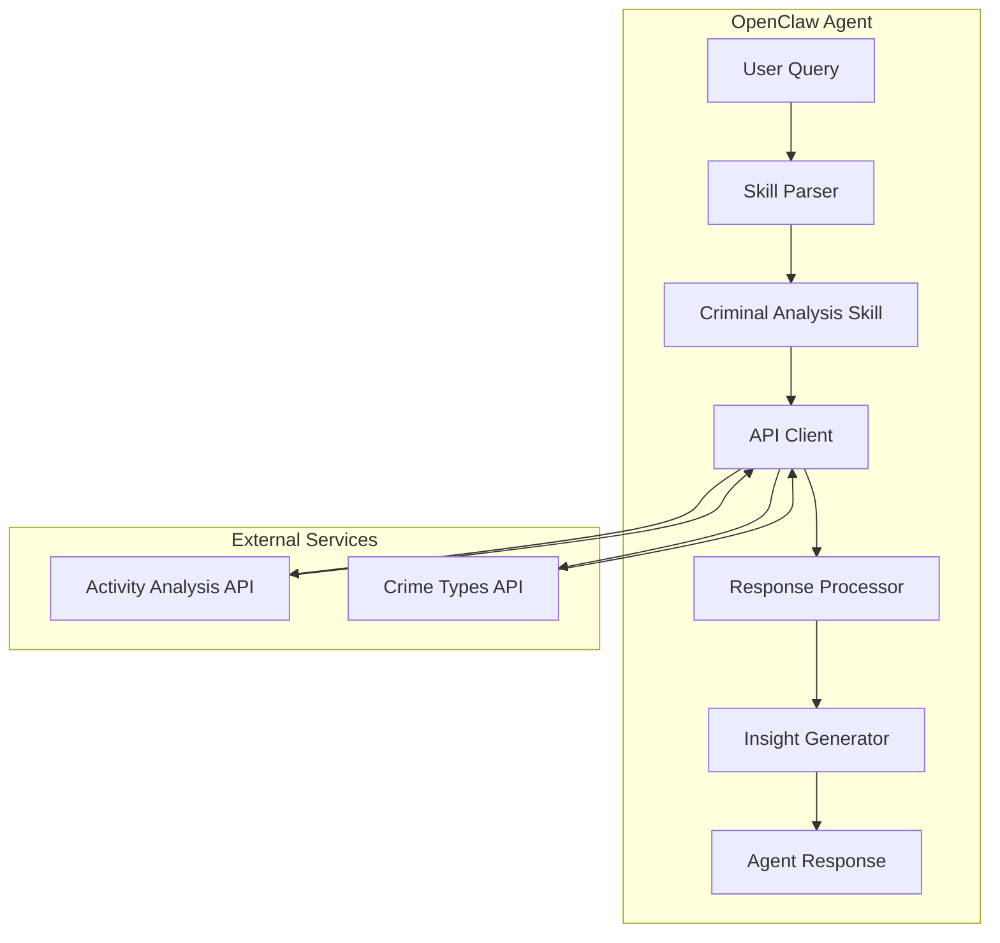

# Technical Specification: Criminal Activity Analysis Skill

> **Version:** 1.0  
> **Date:** 2026-01-31  
> **Status:** Draft  
> **Related PRD:** [criminal-activity-analysis-prd.md](./criminal-activity-analysis-prd.md)

---

## 1. System Architecture



---

## 2. API Contracts

### 2.1 Activity Analysis API

**Endpoint:** `POST http://thomas:11004/api/v1/criminal/activity-analysis/analyze`

#### Request

| Header | Value | Required |
|--------|-------|----------|
| `X-API-KEY` | `{CRIMINAL_ANALYSIS_API_KEY}` | Yes |
| `Content-Type` | `application/json` | Yes |

| Body | Type | Description |
|------|------|-------------|
| Raw text | `string` | Location query (address, landmark, neighborhood) |

#### Response Schema

```typescript
interface ActivityAnalysisResponse {
  id: string | null;
  type: string | null;
  location: GeoLocation;
  content: Record<TimePeriod, PeriodData>;
}

interface GeoLocation {
  x: number;           // longitude
  y: number;           // latitude
  type: "Point";
  coordinates: [number, number];  // [longitude, latitude]
}

type TimePeriod = "dawn" | "morning" | "afternoon" | "night";

interface PeriodData {
  scorePosition: number;
  score: number;
  criminalDangerZonesContainingLocation: DangerZone[];
  occurrencesWithinCriminalDangerZones: CrimeOccurrence[];
}

interface DangerZone {
  id: string;
  gridIndex: [string, string];
  score: number;
  location: PolygonLocation;
}

interface CrimeOccurrence {
  crimeType: number;   // Crime type ID
  count: number;       // Number of occurrences
}
```

---

### 2.2 Crime Types API

**Endpoint:** `GET http://thomas:11004/api/v1/criminal/types/{crimeTypeId}`

#### Request

| Header | Value | Required |
|--------|-------|----------|
| `X-API-KEY` | `{CRIMINAL_ANALYSIS_API_KEY}` | Yes |
| `Accept` | `application/json` | Yes |

| Path Param | Type | Description |
|------------|------|-------------|
| `crimeTypeId` | `number` | Crime type identifier |

#### Response Schema

```typescript
interface CrimeTypeResponse {
  id: number;
  description: string;   // Portuguese description
  score: number;         // Severity weight (1-10)
}
```

---

## 3. Data Models

### 3.1 Period Configuration

```typescript
const PERIOD_MAX_SCORES: Record<TimePeriod, number> = {
  dawn: 128000.0,
  afternoon: 165000.0,
  morning: 185000.0,
  night: 300000.0
};

const PERIOD_LABELS: Record<TimePeriod, string> = {
  dawn: "Dawn",
  morning: "Morning", 
  afternoon: "Afternoon",
  night: "Night"
};
```

### 3.2 Risk Level Classification

```typescript
enum RiskLevel {
  HIGH = "high",
  MEDIUM = "medium",
  LOW = "low"
}

interface RiskThresholds {
  high: number;    // 70% of max score
  medium: number;  // 30% of max score
}

function calculateThresholds(maxScore: number): RiskThresholds {
  return {
    high: maxScore * 0.70,
    medium: maxScore * 0.30
  };
}

function classifyRisk(score: number, period: TimePeriod): RiskLevel {
  const maxScore = PERIOD_MAX_SCORES[period];
  const thresholds = calculateThresholds(maxScore);
  
  if (score > thresholds.high) return RiskLevel.HIGH;
  if (score > thresholds.medium) return RiskLevel.MEDIUM;
  return RiskLevel.LOW;
}
```

### 3.3 Analysis Result Model

```typescript
interface AnalysisResult {
  location: {
    query: string;
    coordinates: [number, number];
  };
  periods: PeriodAnalysis[];
  topCrimes: CrimeDetail[];
  overallRisk: RiskLevel;
  recommendations: string[];
}

interface PeriodAnalysis {
  period: TimePeriod;
  label: string;
  score: number;
  position: number;
  riskLevel: RiskLevel;
  riskEmoji: string;
}

interface CrimeDetail {
  id: number;
  description: string;
  descriptionEnglish: string;
  count: number;
  severity: number;
}
```

---

## 4. Core Functions

### 4.1 API Client

```typescript
interface CriminalAnalysisClient {
  /**
   * Analyze criminal activity for a location
   * @param location - Location query string
   * @returns Activity analysis response
   * @throws ApiError on network or authentication failure
   */
  analyzeLocation(location: string): Promise<ActivityAnalysisResponse>;
  
  /**
   * Get crime type description by ID
   * @param crimeTypeId - Crime type identifier
   * @returns Crime type details
   * @throws ApiError on network or authentication failure
   */
  getCrimeType(crimeTypeId: number): Promise<CrimeTypeResponse>;
}
```

### 4.2 Analysis Processor

```typescript
interface AnalysisProcessor {
  /**
   * Process raw API response into structured analysis
   * @param response - Raw API response
   * @param crimeTypes - Map of crime type ID to details
   * @returns Processed analysis result
   */
  processResponse(
    response: ActivityAnalysisResponse,
    crimeTypes: Map<number, CrimeTypeResponse>
  ): AnalysisResult;
  
  /**
   * Get top N crimes by occurrence count
   * @param occurrences - Array of crime occurrences
   * @param limit - Maximum number of crimes to return
   * @returns Sorted array of top crimes
   */
  getTopCrimes(
    occurrences: CrimeOccurrence[],
    limit: number
  ): CrimeOccurrence[];
}
```

### 4.3 Insight Generator

```typescript
interface InsightGenerator {
  /**
   * Generate human-readable safety report
   * @param analysis - Processed analysis result
   * @returns Formatted markdown report
   */
  generateReport(analysis: AnalysisResult): string;
  
  /**
   * Generate recommendations based on crime data
   * @param topCrimes - Top crimes in the area
   * @param overallRisk - Overall risk level
   * @returns Array of recommendation strings
   */
  generateRecommendations(
    topCrimes: CrimeDetail[],
    overallRisk: RiskLevel
  ): string[];
}
```

---

## 5. Error Handling

### 5.1 Error Types

```typescript
enum ErrorCode {
  NETWORK_ERROR = "NETWORK_ERROR",
  AUTH_FAILURE = "AUTH_FAILURE",
  INVALID_LOCATION = "INVALID_LOCATION",
  API_ERROR = "API_ERROR",
  PARSE_ERROR = "PARSE_ERROR"
}

interface ApiError {
  code: ErrorCode;
  message: string;
  details?: unknown;
}
```

### 5.2 Error Messages

| Error Code | User Message |
|------------|--------------|
| `NETWORK_ERROR` | "Unable to connect to the criminal analysis service. Please try again later." |
| `AUTH_FAILURE` | "Authentication failed. Please check your API key configuration." |
| `INVALID_LOCATION` | "Could not find the specified location. Please try a more specific address." |
| `API_ERROR` | "The criminal analysis service returned an error. Please try again." |
| `PARSE_ERROR` | "Unable to process the analysis data. Please contact support." |

---

## 6. Implementation Steps

### Step 1: Create Skill Directory

```
skills/criminal-activity-analysis/
├── SKILL.md
└── examples/
    └── sample-response.json
```

### Step 2: SKILL.md Content

The skill instruction file should include:

1. **Setup section** with environment variable configuration
2. **Quick Start** with curl examples for both endpoints
3. **Response Processing** instructions for the agent
4. **Risk Classification** logic with threshold calculations
5. **Output Format** template for consistent responses

### Step 3: API Integration

```bash
# Analyze location
curl -s -X POST "http://thomas:11004/api/v1/criminal/activity-analysis/analyze" \
  -H "X-API-KEY: ${CRIMINAL_ANALYSIS_API_KEY}" \
  -H "Content-Type: application/json" \
  -d "${LOCATION_QUERY}"

# Get crime type description
curl -s "http://thomas:11004/api/v1/criminal/types/${CRIME_TYPE_ID}" \
  -H "Accept: application/json" \
  -H "X-API-KEY: ${CRIMINAL_ANALYSIS_API_KEY}"
```

---

## 7. Output Format Specification

### 7.1 Response Template

```markdown
**📍 Safety Analysis: {location}**

**{risk_emoji} Overall Assessment: {risk_level} Risk Area**
{risk_description}

**🕐 Time Period Analysis:**
| Period | Risk Level | Position | Score |
|--------|------------|----------|-------|
{period_rows}

**📊 Most Common Crimes ({primary_period}):**
{crime_list}

**💡 Recommendations:**
{recommendations}
```

### 7.2 Risk Level Formatting

| Risk Level | Emoji | Label |
|------------|-------|-------|
| HIGH | 🔴 | High Risk |
| MEDIUM | 🟠 | Medium Risk |
| LOW | 🟢 | Low Risk |

### 7.3 Position Description Templates

| Risk Level | Template |
|------------|----------|
| HIGH | "This zone ranks #{position} most dangerous in São Paulo state during {period}. Exercise extreme caution." |
| MEDIUM | "This zone has moderate risk during {period}, ranking #{position}. Exercise caution." |
| LOW | "This zone is relatively safe during {period}, ranking #{position}." |

---

## 8. Testing Strategy

### 8.1 Unit Tests

| Test Case | Input | Expected Output |
|-----------|-------|-----------------|
| Risk classification - high | score=150000, period=morning | RiskLevel.HIGH |
| Risk classification - medium | score=80000, period=morning | RiskLevel.MEDIUM |
| Risk classification - low | score=30000, period=morning | RiskLevel.LOW |
| Threshold calculation | maxScore=185000 | high=129500, medium=55500 |

### 8.2 Integration Tests

| Test Case | Description |
|-----------|-------------|
| Valid location query | Query "Praça da República" returns valid analysis |
| Invalid location | Query gibberish returns appropriate error |
| Crime type lookup | Lookup ID 492 returns valid description |
| Multiple periods | Response contains all 4 time periods |

### 8.3 Manual Testing

```bash
# Test 1: Analyze known location
curl -X POST "http://thomas:11004/api/v1/criminal/activity-analysis/analyze" \
  -H "X-API-KEY: ${API_KEY}" \
  -H "Content-Type: application/json" \
  -d "praca da republica"

# Test 2: Verify crime type resolution
curl "http://thomas:11004/api/v1/criminal/types/492" \
  -H "Accept: application/json" \
  -H "X-API-KEY: ${API_KEY}"
```

---

## 9. Configuration

### 9.1 Environment Variables

| Variable | Description | Default | Required |
|----------|-------------|---------|----------|
| `CRIMINAL_ANALYSIS_API_KEY` | API authentication key | - | Yes |
| `CRIMINAL_ANALYSIS_API_URL` | Base API URL | `http://thomas:11004` | No |
| `CRIMINAL_ANALYSIS_TOP_CRIMES` | Number of top crimes to display | `10` | No |

### 9.2 Skill Metadata

```yaml
---
name: criminal-activity-analysis
description: Analyze criminal activity and safety levels for locations in São Paulo state.
homepage: http://thomas:11004/api/v1
metadata:
  openclaw:
    emoji: "🚨"
    requires:
      bins: ["curl"]
      env: ["CRIMINAL_ANALYSIS_API_KEY"]
    primaryEnv: "CRIMINAL_ANALYSIS_API_KEY"
---
```

---

## 10. Dependencies

| Dependency | Purpose | Required |
|------------|---------|----------|
| `curl` | HTTP requests to API | Yes |
| `jq` | JSON parsing (optional) | No |

---

## 11. Security Considerations

- API key must be stored securely via environment variable
- Never log or expose API key in error messages
- Validate and sanitize location input before API calls
- All communication is over internal network (thomas:11004)

---

## 12. Future Considerations

- Add support for other states beyond São Paulo
- Implement historical trend analysis
- Add crime heatmap visualization
- Support for real-time crime alerts
